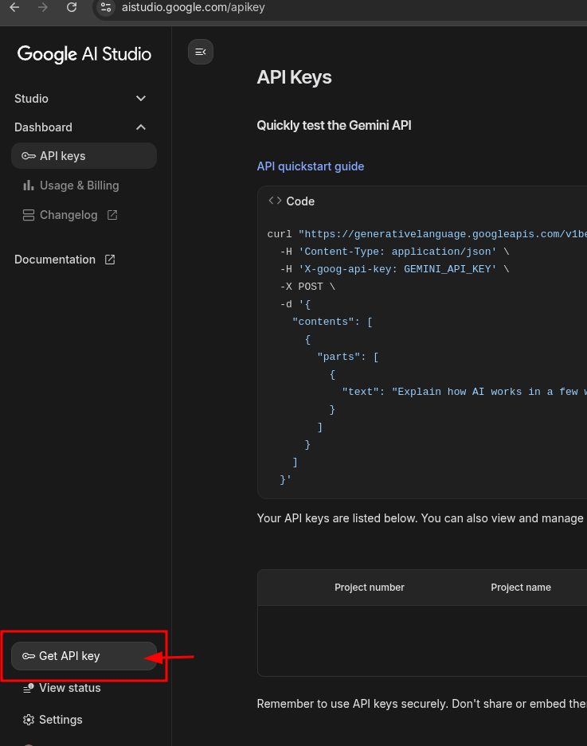
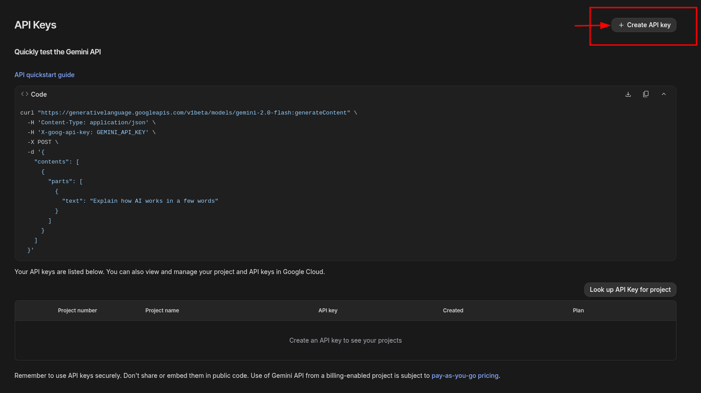
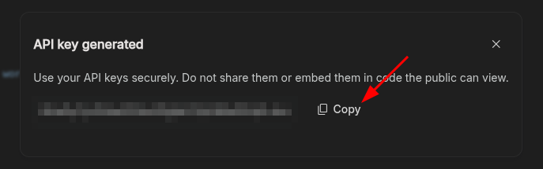

# webvisionsheet

## Development

### Prerequisites

- Node.js 20+ and npm

### Environment Setup

Create a `.env` file in the root directory with the following variables:

```env
GEMINI_API_KEY=api_key (optional)
```

To get a Gemini API key:

1. Sign in to [Google AI Studio](https://aistudio.google.com).
   
   

2. Click Create API key.
   
   

3. Copy your API key.
   
   


### Important note for mac

Please install this and make sure you using v22 node version

```
npm install @rollup/rollup-darwin-arm64
```


### Run the App (Development)

Install dependencies:

```bash
npm install
```

Start the app in development mode:

```bash
npm run dev
```

Optional: preview the production build locally:

```bash
npm start
```

### Building for Production / Release the app

Build the application for your platform:

```bash
npm run build
```

For specific platforms:

```bash
npm run build:win    # Windows
npm run build:mac    # macOS
npm run build:linux  # Linux
```

## Release the app

1. Update the package.json version
2. Tag the version

```bash
git tag v1.2.3
```

3. Push the tag to github https://github.com/gogosoon/Web-vision-sheet 
```
git push github v1.2.3
```


## Project Structure

```
src/
├── main/           # Electron main process
├── preload/        # Preload scripts for secure IPC
└── renderer/       # React application
    ├── components/ # Reusable UI components
    ├── lib/        # Core services and utilities
    └── screens/    # Application screens
```
